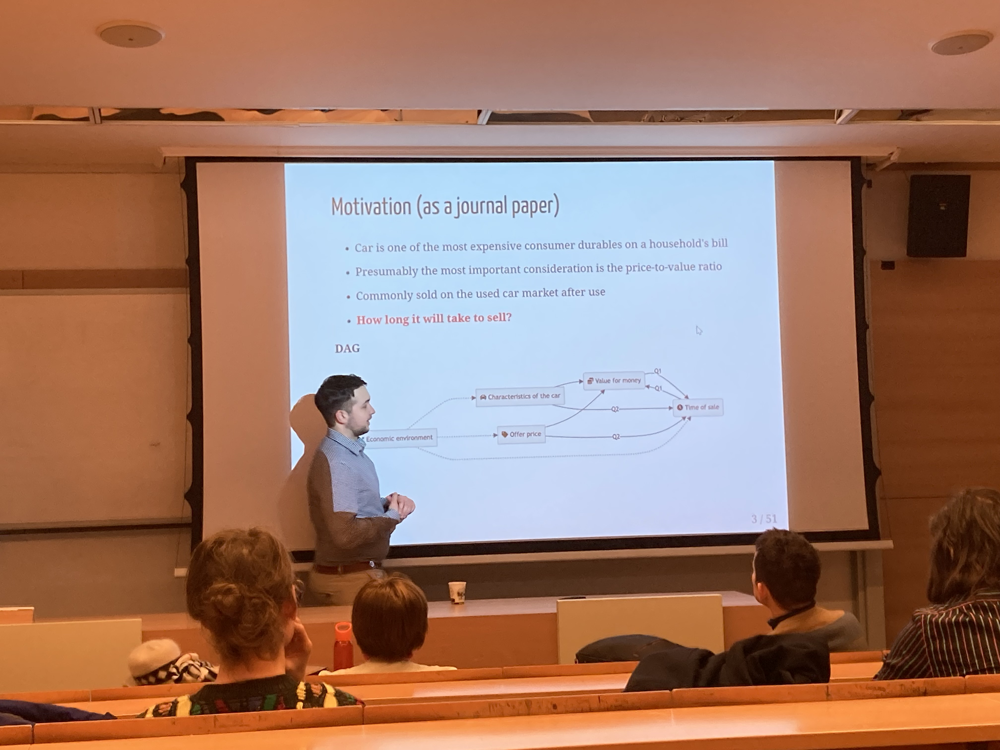

I had the honor of being invited to present one our current research at the "Data Analysis in Practice" series. This time, the focus was the used car market, but I was able to present our research to interested visitors with a detailed description of the methodology. We are extremely proud of this study because it combines the modern machine learning tools and survival analysis in a complex way to answer a research question that is important to everyone.

The enclosed slideshow helps you understand the intuition behind the models and why each methodological step is justified.

<iframe class="responsive-iframe" src="https://marcellgranat.github.io/used-car-liquidity/analysis-in-practice.html"></iframe>

